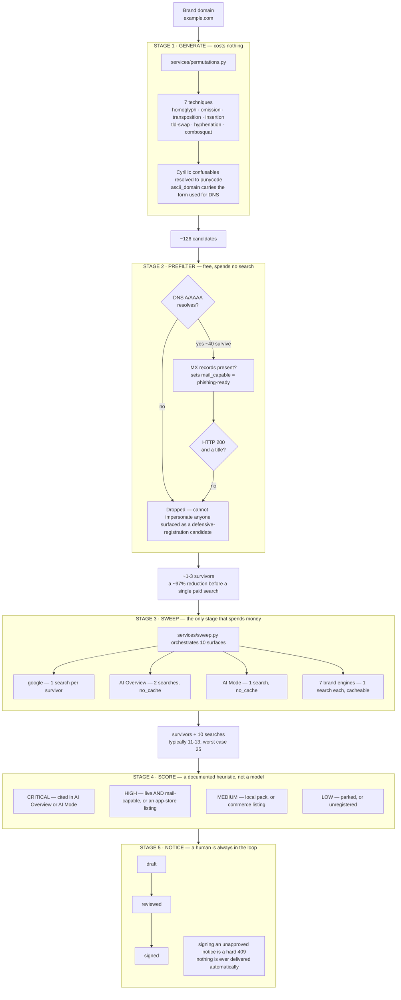
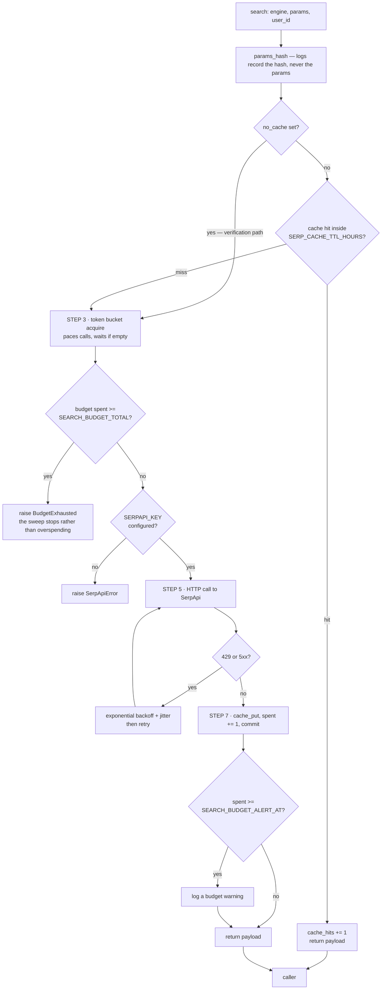
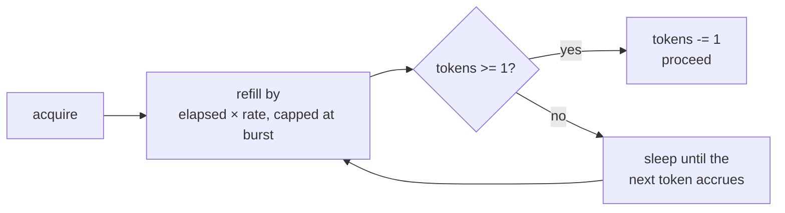
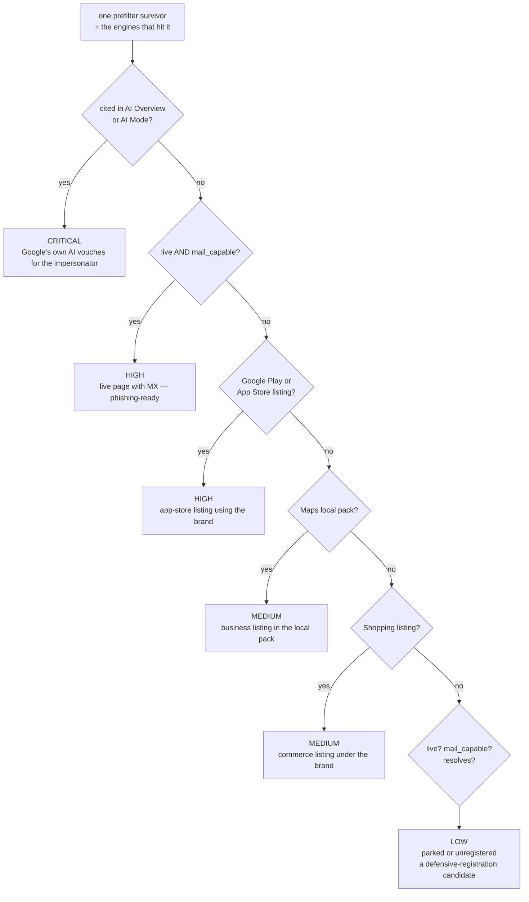
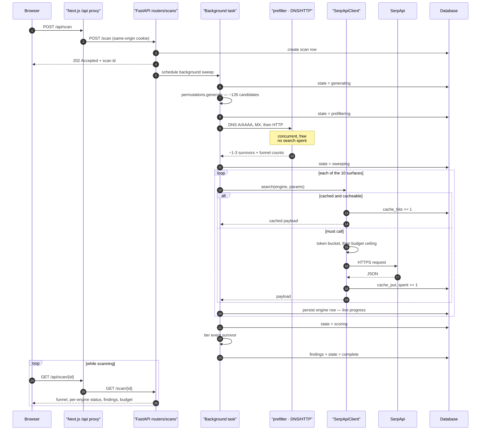
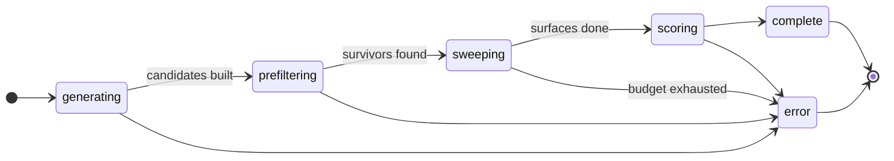
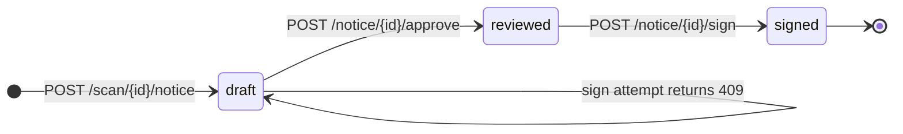
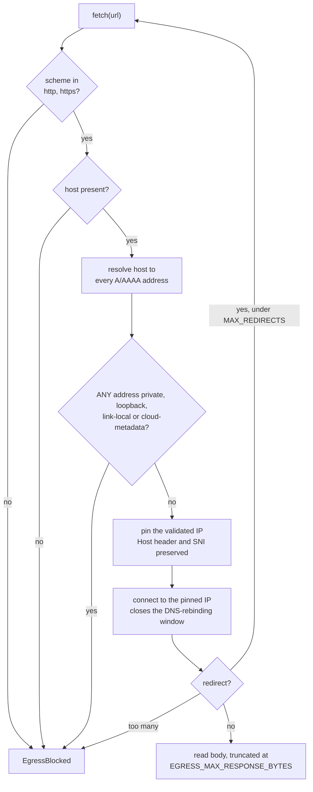
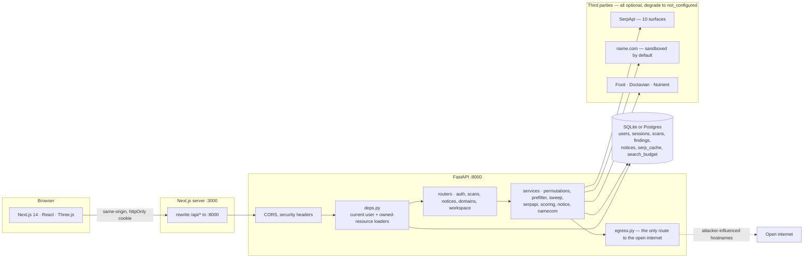
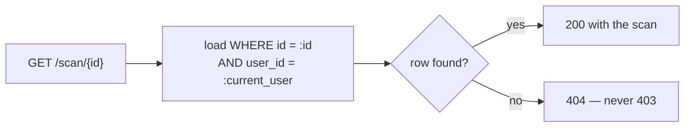

# How Ceasefire works

Every diagram below is drawn from the code, not from intent. File and function names are
real; follow them into `backend/app/` to check any claim here.

---

## 1 · The whole pipeline, end to end

One brand domain in, a tiered set of findings and a drafted takedown notice out. The rule
the whole design turns on: **every expensive stage is protected by a free one.**

**Why the funnel is the whole product.** A naive sweep of 126 permutations across 10
surfaces is **1,260 searches** — five months of a free-tier budget in one run. DNS and
HTTP checks cost nothing and remove ~97% of candidates before SerpApi is touched, which
is what brings a run down to **2–4 paid searches** in the common case.

---

## 2 · Inside one search — the order of operations

`SerpApiClient.search()` in `services/serpapi.py` is the single entry point for every
paid call. **The order matters**: cache before bucket, bucket before budget, budget before
the network. Nothing else in the codebase may call SerpApi directly.

The budget ceiling is checked **before** the call, never after, so the ceiling raises
rather than overspending. A cache hit never touches the bucket or the budget — which is
why a repeat sweep of the same brand is close to free.

### Why `no_cache` on the AI surfaces

`google_ai_overview` and `google_ai_mode` set `no_cache=True`. A cached citation is a
**missed detection** — the entire point of those surfaces is to catch a citation that
appeared since the last look. Staleness is harmless for Trends; it is disqualifying here.

---

## 3 · The token bucket

Paces calls so SerpApi is never hammered. It is **not** the quota guard — the monthly
`SEARCH_BUDGET_TOTAL` is.

> **Calibration rule:** the burst must exceed the searches **one sweep** spends, or every
> sweep stalls on the bucket. Worst case is `DEMO_MAX_PERMUTATIONS` google searches
> + 2 AI Overview + 1 AI Mode + 7 brand engines = **25**. Defaults are `SERPAPI_BURST=30`
> and `SERPAPI_RATE_PER_HOUR=3600` (one token per second), so a sweep never waits and
> refill keeps pace with real call latency.

---

## 4 · Risk tiering — the exact decision order

From `services/scoring.py`. First match wins, top to bottom. Every reason names the
measurement behind it, and there is deliberately **no confidence score**, because no
measurement exists that would justify one.

Only **prefilter survivors** become findings. Candidates that never resolved are not
findings at all — they are defensive-registration opportunities, which is what the domain
portfolio is for.

---

## 5 · A sweep, as a sequence

`POST /scan` returns `202` immediately and the work runs as a background task owning its
own DB session. Each engine result is persisted the moment it lands, so the UI can poll
`GET /scan/{id}` and watch progress live.

---

## 6 · Scan and notice lifecycles

A resumed scan skips any engine already marked `done` or `cached`, so it never re-spends
a search it has already paid for. One surface failing is recorded against that engine and
**does not sink the sweep**.

> **Nothing is ever delivered to a registrant automatically.** Signing an unapproved
> notice is a hard `409`. A legal accusation against a real business gets a human
> signature, or it does not go out — an automated false accusation is worse than a missed
> detection.

---

## 7 · The SSRF guard

Every hostname in this pipeline is **attacker-influenced input**: generated permutations,
and URLs pulled out of search results. `services/egress.py` is the only way out to the
network for any of it.

**One private answer poisons the name.** A hostname resolving to both a public and a
private address is rejected outright — the safe-looking answer does not rescue it.
Redirects are followed manually so that *every hop* is re-validated, not just the first.

---

## 8 · Request path and trust boundaries

**Why the proxy exists.** An httpOnly cookie does not survive a cross-origin XHR from
`:3000` to `:8000` without `SameSite=None; Secure`, which needs HTTPS in dev. Routing
through `/api` makes every request same-origin — rather than weakening the cookie to make
development convenient.

### The authorisation rule

The ownership filter is in the **same query** as the id, so a missing row and someone
else's row are indistinguishable. Returning `403` would confirm the id exists;
`tests/test_idor.py` exists to keep that from regressing.

---

## Where to look next

| Question | File |
|---|---|
| How are lookalikes generated? | `backend/app/services/permutations.py` |
| How is the search budget protected? | `backend/app/services/prefilter.py`, `serpapi.py` |
| How is a finding tiered? | `backend/app/services/scoring.py` |
| How is SSRF prevented? | `backend/app/services/egress.py` |
| How is cross-user access blocked? | `backend/app/deps.py`, `tests/test_idor.py` |
| What does a sweep actually run? | `backend/app/services/sweep.py` |
