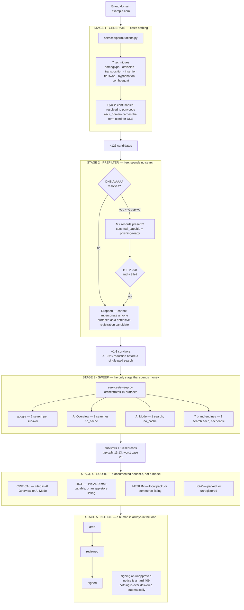

# Ceasefire

**Your brand is being impersonated on ten search surfaces right now. Google's own AI is
citing the impersonator as a source. You will find out from a defrauded customer.**

Ceasefire is the system that finds it first — generating the lookalike domains an attacker
would register, narrowing them with free network checks, sweeping ten search surfaces for
the ones that are actually live, ranking them by how dangerous they are, and drafting the
takedown notice for a human to sign.

---

## The problem

Brand impersonation is no longer a website problem. It is a *surface* problem.

An attacker registers `paypa1.com`, or `pаypal.com` with a Cyrillic **а** that renders
identically to yours. They point MX records at it, clone your landing page, and wait.
The damage does not come from the domain existing. It comes from where the domain
**gets surfaced**:

- **Google's AI Overview cites it as a source** for a query about your brand. The user
  never sees a URL to be suspicious of — they see a synthesised answer with your
  impersonator as the citation. The user's trust is in Google, and Google is vouching.
- A **fake Android app** ships on Google Play using your logo.
- **Counterfeit listings** appear in Shopping with structured price and seller data.
- A **fake business listing** occupies your local pack in Maps.
- An **impersonation channel** on YouTube — the single most common vector behind
  brand-impersonation fraud.

Meanwhile the standard defences fail in specific, boring ways:

| Approach | Why it fails |
|---|---|
| Trademark monitoring | Watches registrations. Blind to whether anything is *live* or *surfaced* |
| Manual searching | Ten surfaces × hundreds of permutations is not a human task |
| Brute-force SERP scanning | 126 permutations × 10 surfaces = **1,260 searches per run**. Economically dead on arrival |

That last row is the real reason this problem stays unsolved at small and mid scale. The
detection is not hard. **The detection is unaffordable.** Ceasefire is an answer to the
economics as much as to the threat.

---

## Our solution

A five-stage pipeline where **every expensive operation is protected by a free one**.



> **Full diagram set — [`ARCHITECTURE.md`](ARCHITECTURE.md)** — the order of operations
> inside a paid search, the token bucket, the exact tiering decision order, a sweep as a
> sequence, scan and notice lifecycles, the SSRF guard, and the trust boundaries.

### The ten surfaces

| Surface | What it answers |
|---|---|
| **AI Overview** | *Does Google's own AI cite an impersonator as a source for the brand?* |
| **AI Mode** | The same question in the conversational surface, across multiple turns |
| Google Search | Is the permutation indexed and live? |
| Google Play / App Store | Fake apps using the brand name or logo |
| Shopping | Counterfeit listings with structured seller and price data |
| Maps / Local | Fake business listings occupying the local pack |
| YouTube | Impersonation channels |
| Images / Lens | Logo and brand-asset misuse |
| Trends | Is search demand for the lookalike *rising*? — an urgency signal |

The two AI surfaces are the headline. Everything else has some prior art. **Nobody is
checking whether the AI answer layer has been convinced to vouch for the fake**, and that
is precisely the surface where the user has no URL to inspect and no reason to doubt.

---

## The economics — the engineering that makes this real

A naive sweep is **1,260 searches**. On SerpApi's free tier that is *five months of budget
in a single run*. Ceasefire brings it to **2–4 searches per sweep**. Four mechanisms, in
order of impact:

**1 · The free funnel runs first.** DNS, then MX, then one HTTP request. 126 candidates
narrow to 1–3 before a single paid search is spent. This is the whole ballgame — a ~97%
reduction using nothing but network calls that cost nothing.

**2 · A hard cap.** `DEMO_MAX_PERMUTATIONS` bounds what reaches the sweep regardless of
how many survive. One pathological brand cannot drain a month.

**3 · A result cache.** Identical queries inside 24h are served from the database and
spend nothing. A second sweep of the same brand typically reports **more cache hits than
searches**. Verification paths set `no_cache` — a stale result there is a missed
detection, and that trade is not worth making.

**4 · A token bucket** with jittered backoff. A scan that hits the ceiling **pauses and
resumes** rather than failing.

Spend is metered per user per calendar month and enforced **before the call, not after**.
The ceiling raises; it never overspends.

> This is the section we would want a judge to read. Any team can call a search API. The
> product only exists if a scan costs cents instead of dollars.

---

## Risk tiering

| Tier | Trigger |
|---|---|
| **CRITICAL** | Cited in Google's AI Overview or AI Mode as a source for the brand |
| **HIGH** | Live page **with MX records** (phishing-ready), or an app-store listing using the brand |
| **MEDIUM** | Local-pack listing, or counterfeit commerce listing |
| **LOW** | Registered and parked, or unregistered — a defensive-registration candidate |

`live AND mail_capable` outranks everything below CRITICAL, because a lookalike that can
both serve a page and receive mail is a phishing campaign with the infrastructure already
paid for.

---

## What we refuse to do

Most of the credibility in this project is in the features we deliberately did not build.

- **No confidence scores.** The tiering is a *documented heuristic*, and the API says so in
  those words. A number like "87% confident" implies a measurement we have not made. We
  will not print one to look sophisticated.
- **No false-positive rate.** None has been established. Publishing one would be a lie with
  a decimal point.
- **No fabricated values, anywhere.** Every figure the API returns is a count, sum or
  average over stored rows belonging to the signed-in user. Nothing is seeded, estimated,
  or carried over from fixtures. When an upstream service refuses, the route returns a
  `reason` field explaining the refusal **instead of inventing a value** — a domain price
  we could not fetch is reported as unavailable, never guessed.
- **No automated takedowns.** Nothing is ever delivered to a registrant automatically. The
  state machine is `draft → reviewed → signed`, and signing an unapproved notice is a hard
  `409`. A legal accusation against a real business gets a human signature or it does not
  go out. **An automated false accusation is worse than a missed detection.**
- **No `*` in CORS.** Exactly one origin. Credentials ride on every request.

---

## Security

Not an afterthought — it is a testing category with dedicated suites.

- **Passwords:** Argon2id. Plaintext is never stored or logged.
- **Sessions:** opaque 32-byte tokens in an httpOnly cookie. **Only the sha256 is
  persisted**, so a database leak yields no working token. Sign-out sets `revoked_at`,
  killing a copied token server-side — not merely clearing a cookie.
- **IDOR discipline:** owned-resource loaders filter on `user_id` **in the same query** as
  the id, and return `404` — never `403`, because a `403` confirms the id exists. A second
  user sees zeroes and empty lists, never a trace of the first. `tests/test_idor.py` exists
  to keep it that way.
- **SSRF controls:** these hostnames are attacker-influenced input. `services/egress.py`
  resolves the hostname, rejects private, loopback, link-local and cloud-metadata ranges,
  **pins the validated IP for the actual connection** (closing the TOCTOU window), and
  **re-validates every redirect hop**. A public hostname with one private answer is
  rejected outright.
- **No secrets in responses:** response models are built field by field; an ORM object is
  never serialised wholesale, so `password_hash` and `token_hash` cannot ride along. Logs
  record a `params_hash`, not the params.

---

## Real-world impact

**Who this is for:** organisations with a brand worth impersonating and no brand-protection
budget — regional banks, D2C brands, clinics, universities, fintech startups. Enterprise
brand protection is a five-figure annual contract. Everyone below that line is currently
defended by *nothing*.

| Before | After |
|---|---|
| Impersonation found when a customer reports fraud | Found before the campaign converts |
| Ten surfaces checked manually, or not at all | Ten surfaces swept in one pass |
| 1,260 searches — economically impossible | 2–4 searches per sweep |
| Notice drafted by counsel, days of turnaround | Drafted in the same pass, human-signed |
| "Is our AI Overview compromised?" — unanswerable | A direct CRITICAL finding |

The compounding effect is on the **LOW** tier: unregistered permutations surface as
defensive-registration candidates with live availability and pricing. The cheapest takedown
in existence is registering the domain yourself for the price of a coffee, *before* the
attacker does.

---

## Folder structure

```
SERP/
├── README.md                     this file
├── ARCHITECTURE.md               10 mermaid diagrams — how the pipeline actually runs
├── backend/                      FastAPI service — 3,817 lines
│   ├── app/
│   │   ├── main.py               app factory, CORS, security headers, router mounting
│   │   ├── config.py             settings, read once from backend/.env
│   │   ├── db.py                 engine, session, create_all
│   │   ├── models.py             SQLAlchemy tables
│   │   ├── schemas.py            request/response models (responses serialise camelCase)
│   │   ├── security.py           Argon2id, session tokens, rate limiting
│   │   ├── deps.py               current user + owned-resource loaders (the IDOR rule)
│   │   ├── routers/
│   │   │   ├── auth.py           signup · signin · signout · me
│   │   │   ├── scans.py          POST /scan (background) · GET /scan/{id} · /scans
│   │   │   ├── notices.py        draft → approve → sign
│   │   │   ├── domains.py        availability · defensive registration
│   │   │   └── workspace.py      overview · findings · notices · domains ·
│   │   │                         surfaces · integrations · budget
│   │   └── services/
│   │       ├── permutations.py   the 7 techniques, Cyrillic → punycode
│   │       ├── prefilter.py      the free DNS/MX/HTTP funnel
│   │       ├── serpapi.py        the 10 surfaces, budget, cache, token bucket
│   │       ├── sweep.py          orchestration across surfaces
│   │       ├── scoring.py        CRITICAL/HIGH/MEDIUM/LOW heuristic
│   │       ├── notice.py         takedown drafting
│   │       ├── namecom.py        availability + registration (sandboxed by default)
│   │       └── egress.py         SSRF-guarded HTTP client
│   └── tests/                    194 tests — 2,294 lines, no network required
│       ├── test_idor.py          cross-user isolation
│       ├── test_egress.py        SSRF guards
│       └── test_auth · permutations · prefilter · serpapi · sweep · notices · workspace
│
└── Frontend/                     Next.js 14 · TypeScript · Tailwind — 4,877 lines
    ├── app/                      layout · page · globals.css
    ├── components/
    │   ├── views/                Overview · Findings · Domains · Notices ·
    │   │                         Surfaces · Sweep · Method · Settings
    │   ├── webgl/                Three.js scene + custom GLSL shaders
    │   ├── ScanInput · ScanProgress · FindingCard · NoticePanel · PipelineStats
    │   └── AuthScreen · AppShell · Navbar · Drawer · UserMenu
    ├── lib/                      api · session · types · workspace
    └── next.config.mjs           /api/* → :8000 same-origin proxy
```

**Why the proxy:** an httpOnly cookie does not survive a cross-origin XHR from `:3000` to
`:8000` without `SameSite=None; Secure`, which needs HTTPS in dev. Routing the API through
`/api` makes every request same-origin and sidesteps the problem entirely — rather than
weakening the cookie to make development convenient.

---

## Running it locally

**Backend** (Python 3.11+):

```bash
cd backend
python -m venv .venv
.venv/Scripts/activate            # source .venv/bin/activate on macOS/Linux
pip install -r requirements.txt
cp ../env.example .env            # then fill in SECRET_KEY and SERPAPI_KEY
uvicorn app.main:app --reload     # → http://localhost:8000, docs at /docs
```

**Frontend:**

```bash
cd Frontend
npm install
npm run dev                       # → http://localhost:3000
```

Tables are created on startup; there is no migration step. The default database is a SQLite
file created on first run.

> `.env` is read once at import and cached. `uvicorn --reload` watches `.py` files only —
> **after editing `.env` you must restart the process.**

Every third-party integration is optional and degrades gracefully. A missing key disables
that feature and is reported as `not_configured` by `GET /workspace/integrations`, rather
than failing a request.

---

## Tests

```bash
cd backend && pytest
```

```
194 passed in 27.03s
```

No network access required. Tests run against an in-memory SQLite database and never touch
the development database.

---

## Stack

**Backend** — FastAPI · SQLAlchemy 2.0 · Pydantic v2 · Argon2id · httpx · dnspython
**Frontend** — Next.js 14 · React 18 · TypeScript · Tailwind · Three.js · Lenis
**External** — SerpApi (ten surfaces) · name.com (registration, sandboxed) · Foxit (PDF/eSign) · Doctavian (templates) · Nutrient (review gate)

---

### One line

**Ceasefire finds the impersonation before your customer does — including the one Google's
own AI is citing — and makes it cheap enough that a company without a brand-protection
budget can actually run it.**
